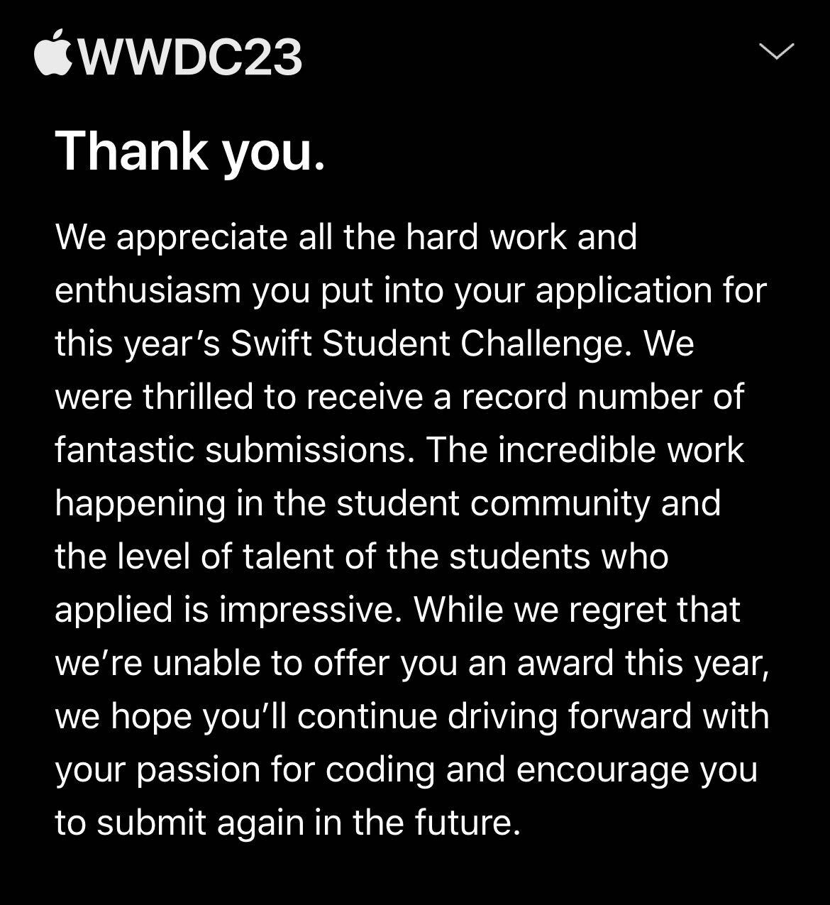

# 🍎 ChokeAid

> My WWDC23 Swift Student Challenge Submission

## Status Update

### My project was rejected, but I'm proud of how much I accomplished within a few days. I learned the Swift and SwiftUI basics and had a great time building my app!

## About

My Swift Playground (ChokeAid) is an application that aims to teach users the knowledge and skills needed to effectively assist someone who is choking. ChokeAid provides users with the signs of choking and step-by-step instructions on how to perform the appropriate procedure to help the choking person.

Using a range of interactive views that include easy-to-understand information and illustrations, ChokeAid helps users to learn the correct procedure for performing back blows and abdominal thrusts. I hope you find my app useful and enjoy it!!!

### Why did I make this app?

As a medical student, I was interested in creating something that would allow users to learn a medical subject, and I decided to choose choking as it is usually a recurring situation that you have to know how to handle correctly in order to help your loved ones or friends who require it. Because there is a lot of information in different sources that can confuse people, I decided to focus the purpose of my app on being an easy to understand guide so that anyone can prepare and learn more on this topic with it.

### Resources

Medical information comes from Mayo Clinic and the Red Cross Organization.

ChokeAid logo and background were created by me, other assets are free-to-use vectors from Canva.

## License

This repository is made open-source with the [MIT License](LICENSE), meaning that you are allowed to modify and distribute the source code as well as use it for private and commercial use provided that the licence and copyright notices are retained. For more information, visit the link above to learn what is permitted by the 
